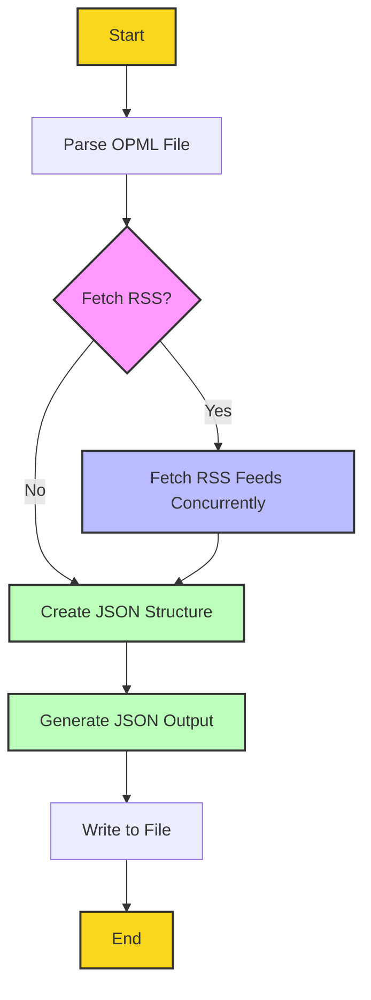

# Go-OPML

[](https://www.gnu.org/licenses/gpl-3.0)
[](https://github.com/jadmadi/Go-OPML)
[](https://github.com/jadmadi/Go-OPML/actions)
[](https://github.com/jadmadi/Go-OPML/releases)

Go-OPML is a command-line tool that converts OPML (Outline Processor Markup Language) files to JSON format and optionally fetches RSS feeds for podcasts listed in the OPML file.

## Table of Contents

- [Go-OPML](#go-opml)
  - [Table of Contents](#table-of-contents)
  - [Features](#features)
  - [Pain Points Solved](#pain-points-solved)
  - [Getting Started](#getting-started)
  - [Installation](#installation)
  - [Usage](#usage)
    - [Options](#options)
  - [Project Structure](#project-structure)
  - [Cross-Platform Compatibility](#cross-platform-compatibility)
  - [Examples](#examples)
  - [Output](#output)
  - [Troubleshooting](#troubleshooting)
  - [Performance Showcase](#performance-showcase)
    - [Test Configuration](#test-configuration)
    - [Test Results](#test-results)
    - [Performance Analysis](#performance-analysis)
  - [Technologies Used](#technologies-used)
  - [Dependencies and Modules](#dependencies-and-modules)
  - [Author](#author)
  - [Contributing](#contributing)
  - [Acknowledgements](#acknowledgements)
  - [License](#license)
  - [Process Overview](#process-overview)

## Features

- Convert OPML files to JSON format
- Fetch RSS feeds for podcasts (optional)
- Concurrent RSS feed fetching for improved performance
- Customizable number of episodes to fetch per podcast
- Adjustable timeout for RSS feed fetching
- Control over concurrent feed fetches

## Pain Points Solved

Go-OPML addresses several challenges faced by podcast enthusiasts and developers working with podcast data:

1. **OPML to JSON Conversion**: Many podcast applications use OPML for importing and exporting podcast subscriptions. However, some may prefer to work with JSON. Go-OPML simplifies this by converting OPML to JSON, a format that's easier to work with in many programming languages and environments.

2. **Bulk RSS Feed Fetching**: Manually fetching RSS feeds for multiple podcasts can be time-consuming. Go-OPML automates this process, allowing you to fetch data for all your podcasts in one go.

3. **Concurrent Processing**: Fetching multiple RSS feeds sequentially can be slow. Go-OPML uses concurrent processing to fetch multiple feeds simultaneously, significantly reducing the overall processing time.

4. **Customizable Output**: The tool allows you to control how many episodes to fetch per podcast and provides timeout settings, giving you flexibility in managing the amount of data and processing time.

5. **Standardized Data Format**: By outputting podcast and episode data in a consistent JSON format, Go-OPML makes it easier to integrate podcast data into various applications or analysis tools.

6. **Command-Line Interface**: Go-OPML provides a simple CLI, making it easy to integrate into scripts or other automated workflows.

7. **Cross-Platform Compatibility**: Built with Go, the tool can be compiled and run on various operating systems, providing a consistent experience across different platforms.

By addressing these pain points, Go-OPML streamlines the process of working with podcast subscription data, whether you're building a podcast app, analyzing podcast trends, or managing your personal podcast subscriptions.

## Getting Started

To quickly get started with Go-OPML:

1. Download the latest release for your platform from the [Releases page](https://github.com/jadmadi/Go-OPML/releases).
2. Extract the downloaded file.
3. Open a terminal and navigate to the extracted directory.
4. Run the following command to convert an OPML file to JSON:

   ```bash
   ./Go-OPML -input your_file.opml -output result.json
   ```

5. To also fetch RSS feeds, add the `-fetch-rss` flag:

   ```bash
   ./Go-OPML -input your_file.opml -output result.json -fetch-rss
   ```

## Installation

1. Ensure you have Go installed on your system (version 1.16 or later recommended).

2. Clone the repository:
   ```bash
   git clone https://github.com/jadmadi/Go-OPML.git
   cd Go-OPML
   ```

3. Install dependencies:
   ```bash
   go mod tidy
   ```

4. Build the application:
   ```bash
   go build -o build/Go-OPML cmd/go-opml/main.go
   ```

5. To install the dependencies, run:
   ```bash
   go get github.com/mmcdole/gofeed
   ```

## Usage

Basic usage:

```bash
./build/Go-OPML -input <input_opml_file> -output <output_json_file> [options]
```

### Options

Here's the full list of options available (output of `./Go-OPML --help`):

```
Go-OPML: OPML to JSON converter with RSS feed fetching capabilities

Usage: ./Go-OPML [options]

Options:
  -concurrency int
        Number of concurrent RSS feed fetches (default 5)
  -fetch-rss
        Fetch RSS feeds and include episode information
  -input string
        Path to the input OPML file
  -max-episodes int
        Maximum number of episodes to fetch per podcast (default 10)
  -output string
        Path to the output JSON file (default "output.json")
  -timeout duration
        Timeout for fetching RSS feeds (default 30s)

Examples:
  Convert OPML to JSON:
    ./Go-OPML -input podcasts.opml -output podcasts.json

  Convert OPML to JSON and fetch RSS feeds:
    ./Go-OPML -input podcasts.opml -output podcasts.json -fetch-rss

  Fetch RSS feeds with custom settings:
    ./Go-OPML -input podcasts.opml -output podcasts.json -fetch-rss -max-episodes 20 -timeout 1m -concurrency 10
```

## Project Structure

The Go-OPML project is organized as follows:

```
go-opml/
├── build/
│   ├── Go-OPML
│   ├── Go-OPML.exe
│   └── Go-OPML-mac
├── cmd/
│   └── go-opml/
│       └── main.go
├── examples/
│   ├── sample.json
│   └── sample.opml
├── internal/
│   ├── json/
│   │   └── generator.go
│   └── opml/
│       └── parser.go
├── pkg/
│   └── rss/
│       └── fetcher.go
├── test/
│   └── parser_test.go
├── go.mod
├── go.sum
├── LICENSE
├── README.md
└── Waqf.en.md
```

- `build/`: Contains compiled binaries for different platforms.
- `cmd/go-opml/`: Contains the main application entry point.
- `examples/`: Holds sample OPML and JSON files for testing.
- `internal/`: Contains packages that are internal to the application.
- `pkg/`: Houses packages that could potentially be used by external projects.
- `test/`: Contains test files.

## Cross-Platform Compatibility

Go-OPML can be compiled for different platforms from a Linux machine. Use the following commands:

1. For Windows (64-bit):
   ```bash
   GOOS=windows GOARCH=amd64 go build -o build/Go-OPML.exe cmd/go-opml/main.go
   ```

2. For macOS (64-bit):
   ```bash
   GOOS=darwin GOARCH=amd64 go build -o build/Go-OPML-mac cmd/go-opml/main.go
   ```

3. For Linux (64-bit):
   ```bash
   GOOS=linux GOARCH=amd64 go build -o build/Go-OPML-linux cmd/go-opml/main.go
   ```

## Examples

Here's a small sample OPML file and its resulting JSON output:

Sample OPML (`sample.opml`):
```xml
<?xml version="1.0" encoding="UTF-8"?>
<opml>
    <head/>
    <body version="1.0">
        <outline xmlUrl="https://feeds.megaphone.fm/thediaryofaceo" title="The Diary Of A CEO with Steven Bartlett"/>
        <outline xmlUrl="https://feeds.simplecast.com/e_GRxR9a" title="Azeem Azhar's Exponential View"/>
        <outline xmlUrl="http://feeds.harvardbusiness.org/harvardbusiness/ideacast" title="HBR IdeaCast"/>
    </body>
</opml>
```

Command:
```bash
./Go-OPML -input sample.opml -output sample.json -fetch-rss
```

Resulting JSON (`sample.json`):
```json
[
  {
    "title": "The Diary Of A CEO with Steven Bartlett",
    "url": "https://feeds.megaphone.fm/thediaryofaceo",
    "episodes": [
      {
        "title": "The Investing Expert: We're Raising The Most Unhappy Generation In History! The Unseen Link Between Marriage & Wealth! Hard Work Doesn't Build Wealth! - Scott Galloway",
        "link": "",
        "publishDate": "2024-07-11T05:00:00Z",
        "description": "The millionaire entrepreneur revealing Wall Street's secrets and simplifying finance for the masses\n\n Scott Galloway is a Professor of Marketing at the New York Stern School of Business and host of the 'Pivot' podcast about technology and business. He is also the best-selling author of books such as, 'The Algebra of Happiness', 'The Four', and 'The Algebra of Wealth'. \n\nIn this conversation, Scott and Steven discuss topics such as, billionaire money hacks, the 6 fundamental rules of investing, how to make $7 million from nothing, and how marriage can make you rich.\n\n..."
      }
    ]
  },
  {
    "title": "Azeem Azhar's Exponential View",
    "url": "https://feeds.simplecast.com/e_GRxR9a",
    "episodes": [
      {
        "title": "The Science of Making Truthful AI",
        "link": "https://hbr.org/podcasts/exponential-view",
        "publishDate": "2024-02-07T13:17:29Z",
        "description": "Artificial Intelligence is on every business leader's agenda. How do we make sense of the fast-moving new developments in AI over the past year? Azeem Azhar returns to bring clarity to leaders who face a complicated information landscape.\n\nThis week, Azeem speaks with Richard Socher, CEO and founder of You.com, an AI chatbot search engine at the forefront of truthful and verifiable AI. They explore approaches to building AI systems that are both truthful and verifiable. The conversation sheds light on the critical breakthroughs in AI, the technical challenges of ensuring AI's reliability, and Socher's vision for the future of search.\n\n..."
      }
    ]
  },
  {
    "title": "HBR IdeaCast",
    "url": "http://feeds.harvardbusiness.org/harvardbusiness/ideacast",
    "episodes": [
      {
        "title": "Why We Should Pay More Attention to Departing CEOs",
        "link": "https://hbr.org/podcast/2024/07/why-we-should-pay-more-attention-to-departing-ceos",
        "publishDate": "2024-07-09T13:00:32Z",
        "description": "When news breaks of a CEO succession, much of the attention is given to the new leader and how they will change the company. But new research shows that the leave-taking process of the outgoing chief executive is often mishandled, with negative impacts on succession and the organization. Rebecca Slan Jerusalim, an executive director at Russell Reynolds Associates, and Navio Kwok, a leadership advisor at RRA, say that boards are often surprised when a CEO gives notice, and they often make that person feel excluded during the handoff process. The researchers share stories from the front lines about CEO psychology, best practices for outgoing leaders and their boards, and broader lessons for effective transitions. Jerusalim and Kwok wrote the HBR article \"The Vital Role of the Outgoing CEO.\""
      }
    ]
  }
]
```

## Output

The tool generates a JSON file containing an array of podcast objects. Each podcast object includes:

- `title`: The title of the podcast
- `url`: The URL of the podcast's RSS feed
- `episodes`: (If RSS fetching is enabled) An array of recent episodes, each containing:
  - `title`: Episode title
  - `link`: Link to the episode
  - `publishDate`: Publication date of the episode
  - `description`: Episode description

## Troubleshooting

Here are some common issues and their solutions:

1. **"command not found" error when running Go-OPML**
   - Ensure you're in the correct directory containing the Go-OPML executable.
   - Check if the file has execute permissions. If not, run: `chmod +x Go-OPML`

2. **Error parsing OPML file**
   - Verify that your OPML file is well-formed XML.
   - Ensure the file path is correct and the file is readable.

3. **Timeout errors when fetching RSS feeds**
   - Increase the timeout duration: `-timeout 60s`
   - Check your internet connection.

4. **Program seems to hang**
   - For large OPML files, the process might take some time. Use the `-concurrency` flag to speed up RSS fetching.
   - Ensure you have a stable internet connection.

If you encounter any other issues, please [open an issue](https://github.com/jadmadi/Go-OPML/issues) on GitHub.

## Performance Showcase

Go-OPML is designed for efficiency, particularly when handling multiple RSS feeds concurrently. Here's a real-world example of its performance:

### Test Configuration
- **Input OPML file**: Contains 19 podcast feeds
- **Operation**: Convert OPML to JSON and fetch RSS feeds for all podcasts
- **Hardware**: [Your system specifications - this information wasn't provided, so you may want to add it]

### Test Results
```
$ time ./Go-OPML -input jad.opml -output output.json -fetch-rss
Successfully processed OPML and generated JSON. Output written to output.json

real    0m3.813s
user    0m1.662s
sys     0m0.238s
```

### Performance Analysis
- **Total execution time**: 3.813 seconds
- **Number of feeds processed**: 19
- **Average time per feed**: Approximately 0.2 seconds

This test demonstrates Go-OPML's ability to process a substantial number of podcast feeds quickly. In just under 4 seconds, the tool:

1. Parsed the OPML file
2. Fetched RSS data for 19 different podcasts
3. Processed the fetched data
4. Generated and wrote the output JSON file

The efficiency is largely due to Go-OPML's use of concurrent processing, allowing it to fetch and process multiple RSS feeds simultaneously. This makes Go-OPML an excellent choice for handling large OPML files with many podcast subscriptions.

Note: Performance may vary depending on factors such as internet connection speed, server response times of the RSS feeds, and the hardware specifications of the system running Go-OPML.

## Technologies Used

Go-OPML is built using the following technologies:

- **Go (Golang)**: The primary programming language used for the project.
- **XML Processing**: Go's built-in `encoding/xml` package for parsing OPML files.
- **JSON Processing**: Go's built-in `encoding/json` package for generating JSON output.
- **Concurrency**: Go's goroutines and channels for concurrent RSS feed fetching.
- **Command-line Flags**: Go's `flag` package for parsing command-line arguments.

## Dependencies and Modules

Go-OPML relies on the following external module:

- **gofeed**: A robust feed parser for Go. It's used to parse RSS feeds and extract podcast episode information.

To install the dependencies, run:

```bash
go get github.com/mmcdole/gofeed
```

## Author
- **Name:** Jad Madi
- **GitHub:** [@jadmadi](https://github.com/jadmadi)
- **Email:** jad@madi.se
- **Website:** [https://madi.se](https://madi.se)
- **LinkedIn:** [https://linkedin.com/in/hakammadi](https://linkedin.com/in/hakammadi)

For professional inquiries or collaborations, please contact via LinkedIn or website.

## Contributing

Contributions are welcome! Please feel free to submit a Pull Request.

## Acknowledgements

We would like to express our gratitude to the creators and maintainers of the following project:

- [gofeed](https://github.com/mmcdole/gofeed): A robust feed parser for Go, which has been instrumental in enabling efficient RSS feed parsing in this project.

## License

This project is licensed under the GNU General Public License v3.0. See the [LICENSE](LICENSE) file for details.

Additionally, this work adheres to the principles of the [Waqf General Public License](https://github.com/ojuba-org/waqf), aiming to make the work a perpetual charitable endowment (Waqf) for the benefit of all Muslims.

## Process Overview

The following flowchart illustrates the OPML to JSON conversion process:



1. The process begins by parsing the input OPML file.
2. If RSS fetching is enabled, the tool concurrently fetches RSS feeds for each podcast.
3. A JSON structure is created, incorporating the OPML data and fetched RSS information (if applicable).
4. The JSON output is generated.
5. Finally, the resulting JSON is written to the specified output file.

This streamlined process allows for efficient handling of podcast subscription data, with optional RSS feed fetching for comprehensive podcast information.